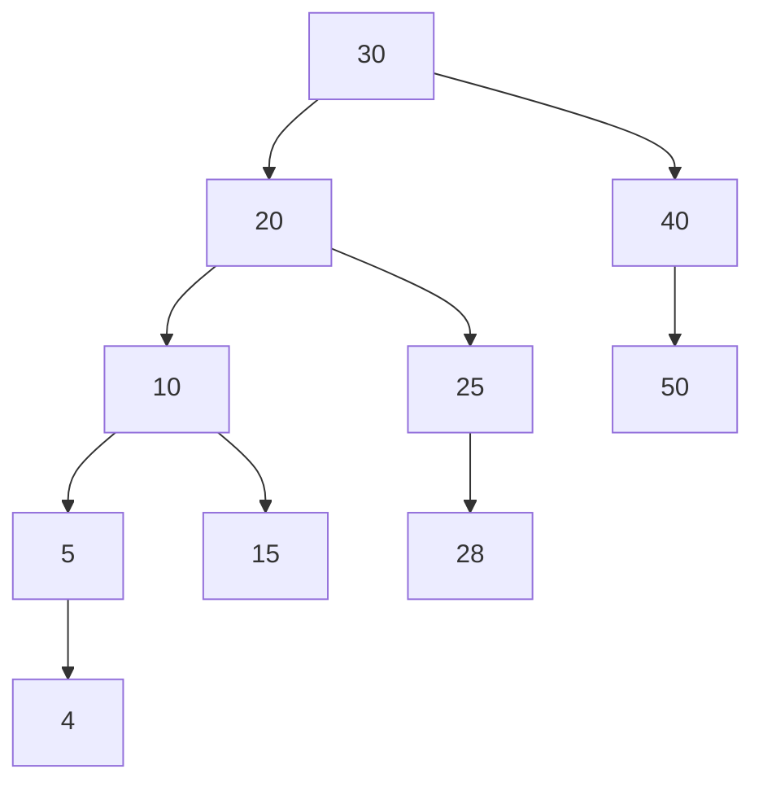
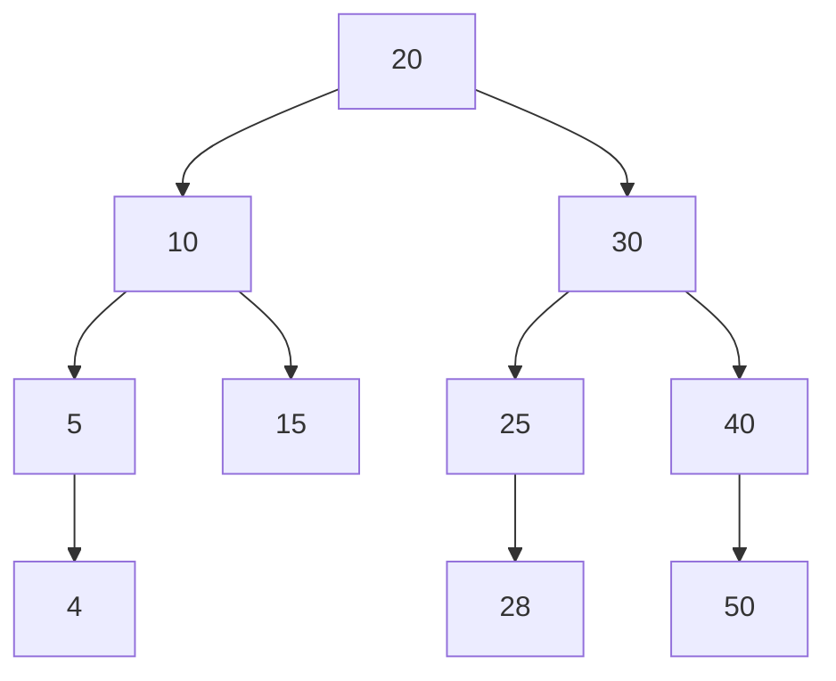
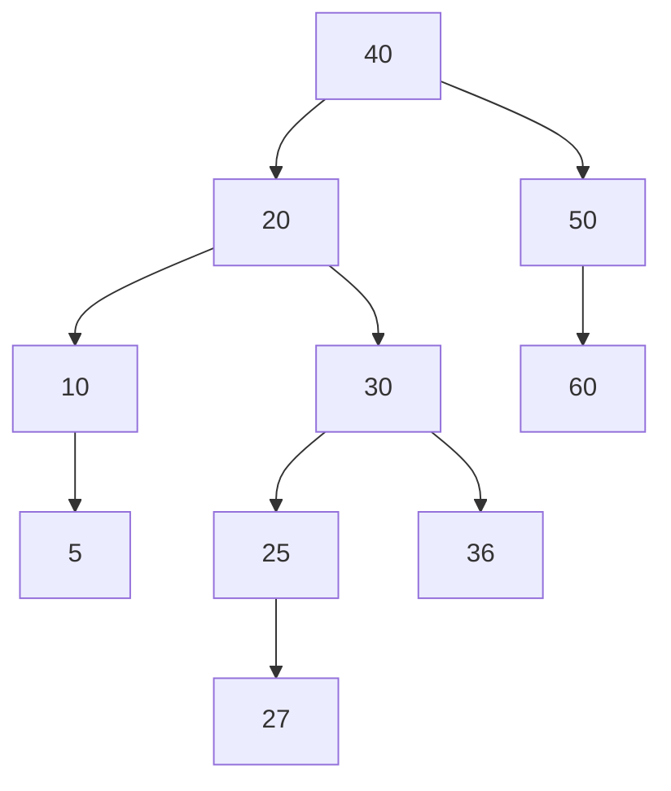
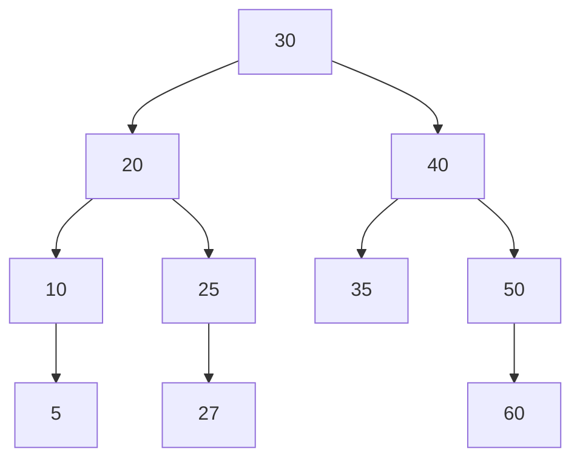
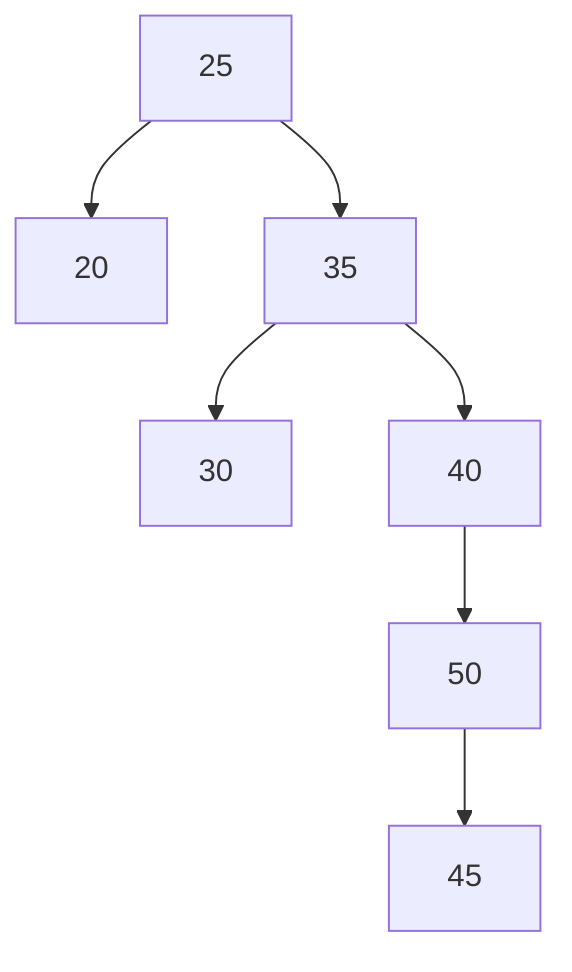
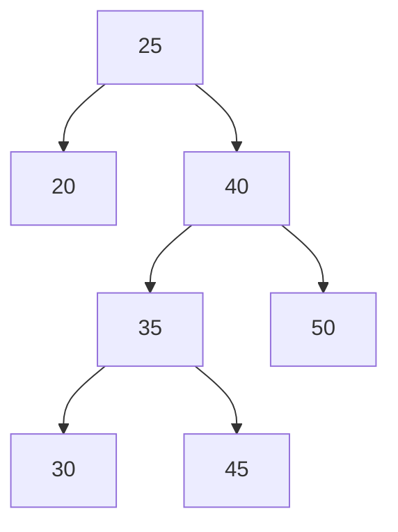
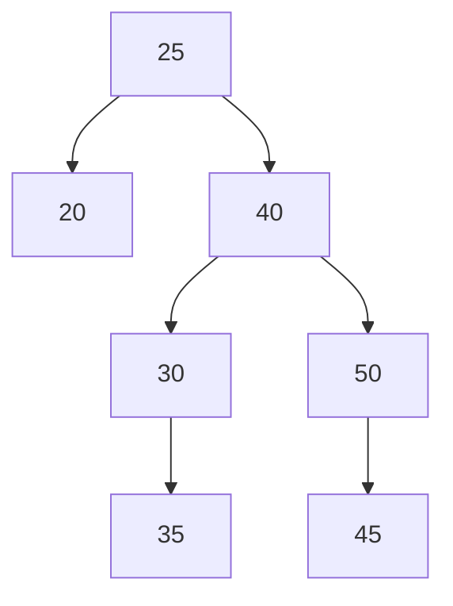
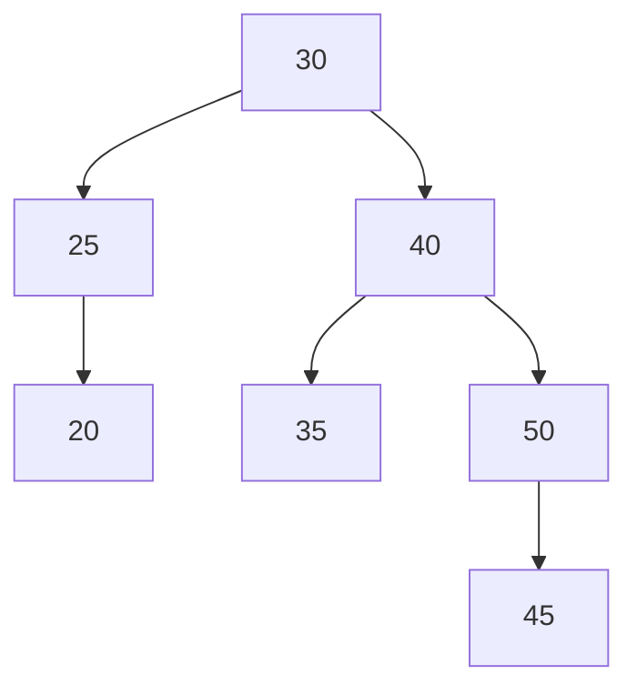

# Self-Balancing BST

Height: (Single node 0) Max(leftSubtree, rightSubtree);
Balance: leftSubtreeHeight - rightSubtreeHeight
To be AVL tree: abs(balance) <= 1

<span style="color:rgb(107, 255, 174)">Left heavy +</span>
<span style="color:rgb(107, 255, 174)">Right heavy -</span>

## AVL Binary Tree implementation

```cpp
#include <iostream>

struct Node {
    int value;
    int height;
    Node* leftChild;
    Node* rightChild;
};

int getNodeHeight(const Node* node) {
    const int leftSubtreeHeight = node && node->leftChild ? node->leftChild->height : 0;
    const int rightSubtreeHeight = node && node->rightChild ? node->rightChild->height : 0;

    return std::max(
        leftSubtreeHeight,
        rightSubtreeHeight
    ) + 1;
}

int getBalanceFactor(const Node* node) {
    const int leftSubtreeHeight = node && node->leftChild ? node->leftChild->height : 0;
    const int rightSubtreeHeight = node && node->rightChild ? node->rightChild->height : 0;

    return leftSubtreeHeight - rightSubtreeHeight;
}

Node* leftLeftRotation(Node* node, Node*& root) {
    Node* newRoot = node->leftChild; // Making the middle node root
    Node* newRootRightChildren = newRoot->rightChild; // Keeping its right child

    newRoot->rightChild = node; // Setting previous parent as a right child
    node->leftChild = newRootRightChildren; // Setting the kept right child as a left child to the previous root

    // Updating the heights
    node->height = getNodeHeight(node);
    newRoot->height = getNodeHeight(newRoot);

    if (root == node)
        root = newRoot;

    return newRoot;
}

Node* rightRightRotation(Node* node, Node*& root) {
    Node* newRoot = node->rightChild; // Making the middle node root
    Node* newRootLeftChildren = newRoot->leftChild; // Keeping its left children

    newRoot->leftChild = node; // Setting previous parent as a left child
    node->rightChild = newRootLeftChildren; // Setting the kept right child as a right child to the previous root

    // Updating the heights
    newRoot->height = getNodeHeight(newRoot);
    node->height = getNodeHeight(node);

    if (root == node)
        root = newRoot;

    return newRoot;
}

Node* leftRightRotation(Node* node, Node*& root) {
    // --- Right rotation ---
    Node* oldLeftChild = node->leftChild;
    Node* newLeftChild = oldLeftChild->rightChild;

    oldLeftChild->rightChild = newLeftChild->leftChild; // Attach the left children from the right rotate
    newLeftChild->leftChild = oldLeftChild; // Setting the old parent as a left child

    node->leftChild = newLeftChild; // Setting the new left child at its new place

    // Updating the heights
    oldLeftChild->height = getNodeHeight(oldLeftChild);
    newLeftChild->height = getNodeHeight(newLeftChild);

    //---------------------------------------------------------------------

    // --- Left rotation ---
    Node* oldRoot = node;
    Node* newRoot = node->leftChild;

    oldRoot->leftChild = newRoot->rightChild; // Attach the right children from the left rotate
    newRoot->rightChild = oldRoot; // Setting the old parent as a right child

    // Updating the heights
    oldRoot->height = getNodeHeight(oldRoot);
    newRoot->height = getNodeHeight(newRoot);

    if (root == node)
        root = newRoot;

    return newRoot;
}

Node* rightLeftRotation(Node* node, Node*& root) {
    // --- Left rotation ---
    Node* oldRightChild = node->rightChild;
    Node* newRightChild = node->rightChild->leftChild;

    oldRightChild->leftChild = newRightChild->rightChild; // Attach the right children from the left rotate
    newRightChild->rightChild = oldRightChild; // Setting the old parent as a right child

    node->rightChild = newRightChild; // Setting the new right child at its new place

    // Updating the heights
    oldRightChild->height = getNodeHeight(oldRightChild);
    newRightChild->height = getNodeHeight(newRightChild);

    //---------------------------------------------------------------------
    // --- Right rotation ---

    Node* oldRoot = node;
    Node* newRoot = node->rightChild;

    oldRoot->rightChild = newRoot->leftChild; // Attach the left children from the right rotate
    newRoot->leftChild = oldRoot; // Setting the old parent as a left child

    // Updating the heights
    oldRoot->height = getNodeHeight(oldRoot);
    newRoot->height = getNodeHeight(newRoot);

    if (root == node)
        root = newRoot;

    return newRoot;
}

Node* insertInAvlBinarySearchTree(Node* node, const int& insertElement, Node* root = nullptr) {
    if (node) {
        if (node->value == insertElement)
            return node;

        root = root ? root : node;

        if (node->value > insertElement)
            node->leftChild = insertInAvlBinarySearchTree(node->leftChild, insertElement);
        else
            node->rightChild = insertInAvlBinarySearchTree(node->rightChild, insertElement);

        node->height = getNodeHeight(node);

        if (getBalanceFactor(node) == 2 && getBalanceFactor(node->leftChild) == 1)
            return leftLeftRotation(node, root);

        else if (getBalanceFactor(node) == 2 && getBalanceFactor(node->leftChild) == -1)
            return leftRightRotation(node, root);

        else if (getBalanceFactor(node) == -2 && getBalanceFactor(node->rightChild) == -1)
            return rightRightRotation(node, root);

        else if (getBalanceFactor(node) == -2 && getBalanceFactor(node->rightChild) == 1)
            return rightLeftRotation(node, root);

        return node;
    }

    return new Node{insertElement, 1, nullptr, nullptr};
}


int main() {
    Node* root = insertInAvlBinarySearchTree(nullptr, 10);

    root = insertInAvlBinarySearchTree(root, 20);
    root = insertInAvlBinarySearchTree(root, 5);

    return 0;
}
```

# Rotations

## Left Left Rotation






![[Pasted image 20250504154931.png]]

___
## Left Right Rotation






![[Pasted image 20250504215154.png]]
___

## Right Right Rotation






![[Pasted image 20250505000717.png]]

___
## Right Left Rotation







![[Pasted image 20250505003950.png]]