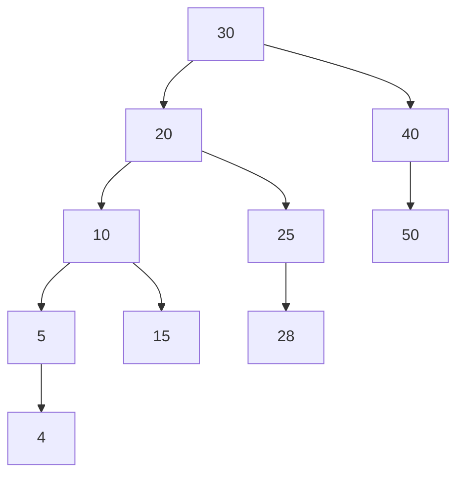
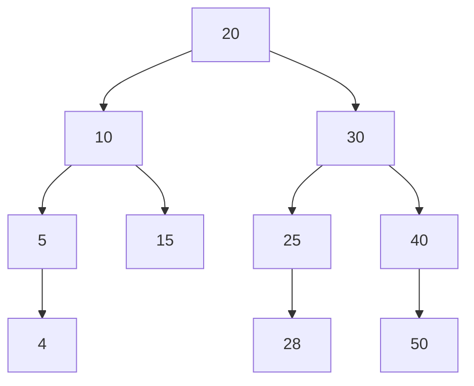
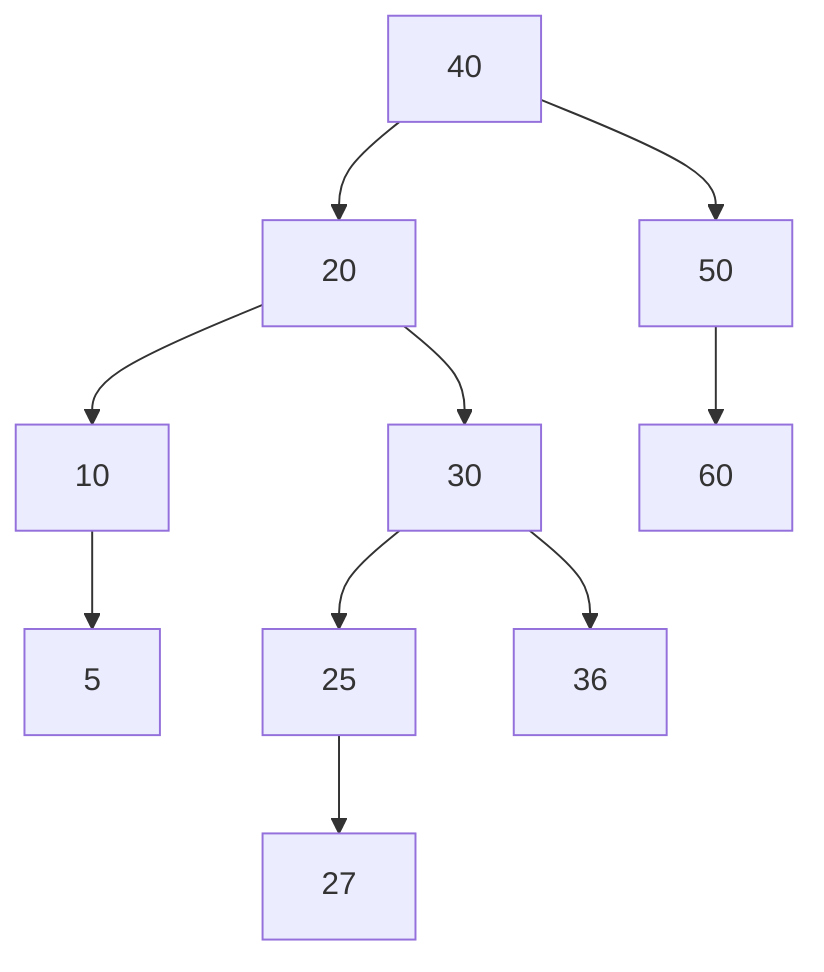
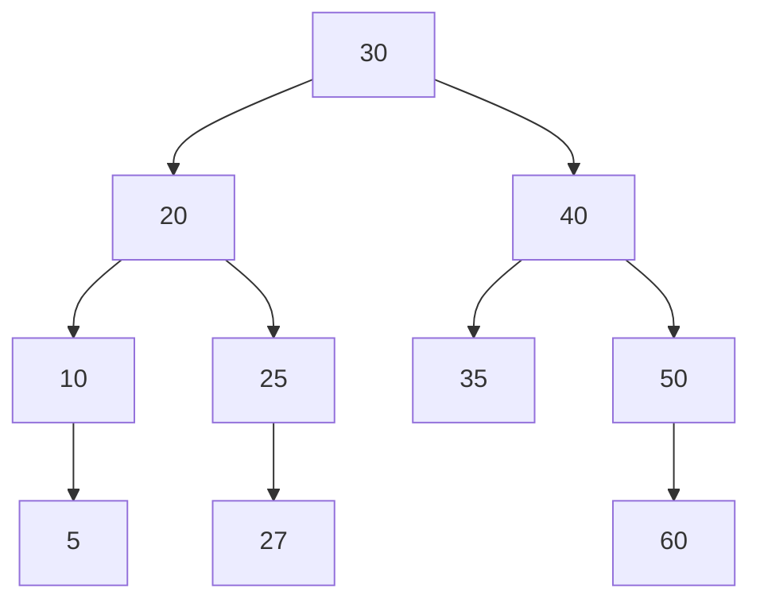

# Self-Balancing BST

Height: (Single node 0) Max(leftSubtree, rightSubtree);
Balance: leftSubtreeHeight - rightSubtreeHeight
To be AVL tree: abs(balance) <= 1

<span style="color:rgb(107, 255, 174)">Left heavy +</span>
<span style="color:rgb(107, 255, 174)">Right heavy -</span>

```cpp
struct Node {
    int value;
    int height;
    Node* leftChild;
    Node* rightChild;
} *root = nullptr;


int getBalanceFactor(const Node* node) {
    const int heightLeftSubTree = node && node->leftChild ? node->leftChild->height : 0;
    const int heightRightSubTree = node && node->rightChild ? node->rightChild->height : 0;

    return heightLeftSubTree - heightRightSubTree;
}

int getNodeHeight(Node* node) {
    return node->height = std::max(
        node->leftChild ? node->leftChild->height : 0,
        node->rightChild ? node->rightChild->height : 0
    ) + 1;
}

// --- Start of Rotations ---

Node* leftLeftRotation(Node* node) {
    Node* nodeLeftChild = node->leftChild;
    Node* nodeLeftChildRightChild = nodeLeftChild->rightChild;

    nodeLeftChild->rightChild = node;
    node->leftChild = nodeLeftChildRightChild;
    node->height = getNodeHeight(node);
    nodeLeftChild->height = getNodeHeight(nodeLeftChild);

    if (root == node)
        root = nodeLeftChild;

    return nodeLeftChild;
}

Node* leftRightRotation(Node* node) {
    Node* nodeLeftChild = node->leftChild;
    Node* nodeLeftChildRightChild = nodeLeftChild->rightChild;

    nodeLeftChild->rightChild = nodeLeftChildRightChild->leftChild;
    node->leftChild = nodeLeftChildRightChild->rightChild;

    nodeLeftChildRightChild->leftChild = nodeLeftChild;
    nodeLeftChildRightChild->rightChild = node;

    nodeLeftChild->height = getNodeHeight(nodeLeftChildRightChild);
    node->height = getNodeHeight(node);
    nodeLeftChildRightChild->height = getNodeHeight(nodeLeftChildRightChild);

    if (root == node)
        root = nodeLeftChildRightChild;

    return nodeLeftChildRightChild;
}

Node* rightRightRotation(Node* node) {
    Node* nodeRightChild = node->rightChild;
    Node* nodeRightChildLeftChild = nodeRightChild->leftChild;

    nodeRightChild->leftChild = node;
    node->rightChild = nodeRightChildLeftChild;

    node->height = getNodeHeight(node);
    nodeRightChild->height = getNodeHeight(nodeRightChild);

    if (root == node)
        root = nodeRightChild;

    return nodeRightChild;
}

Node* rightLeftRotation(Node* node) {
    Node* nodeRightChild = node->rightChild;
    Node* nodeRightChildLeftChild = nodeRightChild->leftChild;

    nodeRightChild->leftChild = nodeRightChildLeftChild->rightChild;
    node->rightChild = nodeRightChildLeftChild->leftChild;

    nodeRightChildLeftChild->rightChild = nodeRightChild;
    nodeRightChildLeftChild->leftChild = node;

    nodeRightChild->height = getNodeHeight(nodeRightChild);
    node->height = getNodeHeight(node);
    nodeRightChildLeftChild->height = getNodeHeight(nodeRightChildLeftChild);

    if (root == node)
        root = nodeRightChildLeftChild;

    return nodeRightChildLeftChild;
}

// --- End of Rotations ---

Node* insertInBinarySearchTree(Node* node, const int& key) {
    if (node) {
        if (node->value == key)
            return node;

		// Directly reassigning the child (no need of previous)  
        if (node->value > key)
            node->leftChild = insertInBinarySearchTree(node->leftChild, key);
        else
            node->rightChild = insertInBinarySearchTree(node->rightChild, key);

        node->height = getNodeHeight(node);

        if (getBalanceFactor(node) == 2 && getBalanceFactor(node->leftChild) == 1)
            return leftLeftRotation(node);

        else if (getBalanceFactor(node) == 2 && getBalanceFactor(node->leftChild) == -1)
            return leftRightRotation(node);

        else if (getBalanceFactor(node) == -2 && getBalanceFactor(node->rightChild) == -1)
            return rightRightRotation(node);

        else if (getBalanceFactor(node) == -2 && getBalanceFactor(node->rightChild) == 1)
            return rightLeftRotation(node);

        return node;
    }

    return new Node{key, 1, nullptr, nullptr};
}

int main() {
    root = insertInBinarySearchTree(root, 10);
    root = insertInBinarySearchTree(root, 5);
    root = insertInBinarySearchTree(root, 1);

    return 0;
}
```

# Rotations

## Left Left Rotation






![[Pasted image 20250504154931.png]]

## Left Right Rotation





![[Pasted image 20250504215154.png]]
