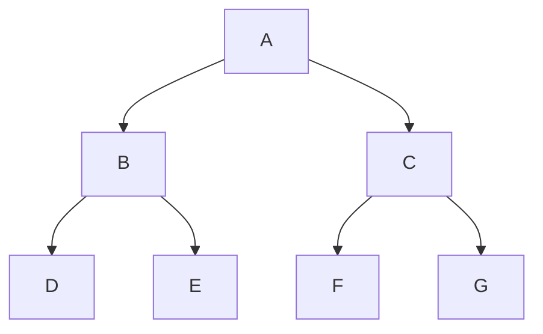
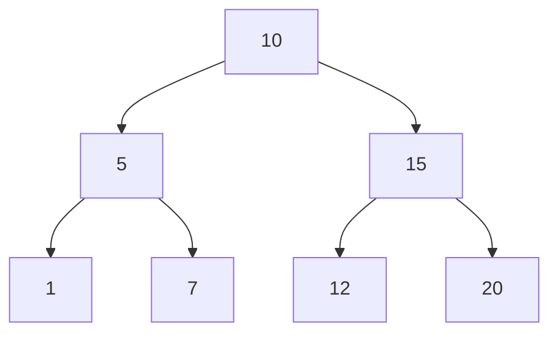
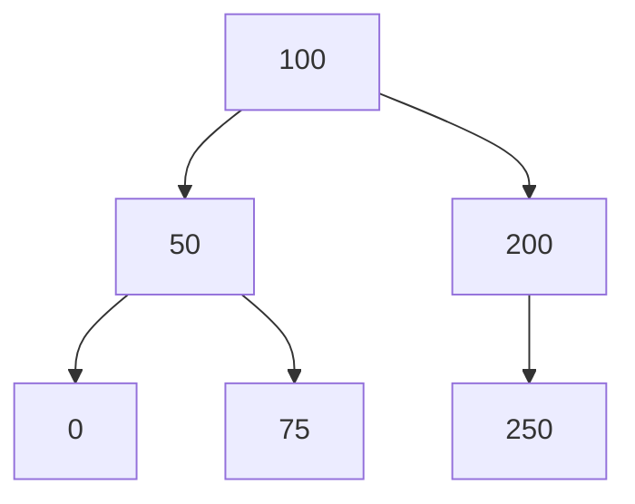

<span style="color:rgb(255, 0, 0)">All Left Subtree elements are smaller.</span>
<span style="color:rgb(255, 0, 0)">All Right Subtree elements are bigger.</span>

Strict | Full Binary Tree: every node has to have 0 or 2 children (not 1)

### Array Representation

Level by level, from left to right.

Element at is at index
<span style="color:rgb(255, 0, 0)">left child index:</span> index * 2 + 1;
<span style="color:rgb(255, 0, 0)">right child index:</span> index * 2 + 2;
<span style="color:rgb(255, 0, 0)">parent index:</span> (index - 1) / 2



### [A B C D E F G]

___
## <span style="color:rgb(97, 175, 239)">Complete Binary Tree</span>

All Elements are filled from left to right



### [10 5 15 1 7 12 20]

## <span style="color:rgb(97, 175, 239)">Non Complete Binary Tree</span>



### [A B C _ E]
### <span style="color:rgb(255, 0, 0)">200 -> 150 is missing</span>


___
## Search for an Element in BST (Binary Search Tree)

```cpp
Node* binarySearchTree(Node* node, const int& searchNumber) {  
    if (node) {  
        if (node->number == searchNumber)  
            return node;  
  
        if (node->number < searchNumber)  
            return binarySearchTree(node->rightChild, searchNumber);  
  
        return binarySearchTree(node->leftChild, searchNumber);  
    }  
    return nullptr;  
}

Node* binarySearchTree(Node* node, const int& searchElement) {  
    while (node) {  
        if (node->data == searchElement)  
            return node;  
        if (node->data > searchElement)  
            node = node->leftChild;  
        else  
            node = node->rightChild;  
    }  
    
    return nullptr;  
}
```

## Create and Insert in BST (Binary Search Tree)

```cpp
struct Node {
    int number;
    Node* leftChild;
    Node* rightChild;
};

Node* insertInBinarySearchTree(Node* node, const int& insertValue, Node* previous = nullptr, Node* first = nullptr) {
    if (node) {
        if (node->number == insertValue)
            return node;

        if (node->number < insertValue)
            return insertInBinarySearchTree(node->rightChild, insertValue, node, first == nullptr ? node : first);

        return insertInBinarySearchTree(node->leftChild, insertValue, node, first == nullptr ? node : first);
    }

    if (previous) {
        Node* newNode = new Node{insertValue, nullptr, nullptr};

        if (previous->number < insertValue)
            previous->rightChild = newNode;
        else
            previous->leftChild = newNode;

        return first;
    }

    return new Node{insertValue, nullptr, nullptr};
}

Node* createBinarySearchTree(const int* array, const int& arraySize) {
    Node* tree = nullptr;

    for (int i = 0; i < arraySize; ++i)
        tree = insertInBinarySearchTree(tree, *(array + i));

    return tree;
}

int main() {
    constexpr int arraySize = 8;
    const int* array = new int[arraySize]{9, 15, 5, 20, 6, 8, 12, 25};

    Node* tree = createBinarySearchTree(array, arraySize);

    delete[] array;

    return 0;
}
```

## Delete element

```cpp
bool deleteElementFromABinarySearchTree(Node*& root, const int& deleteElement) {  
    if (!root)  
        return false;  
  
    Node* previousNode = nullptr;  
    Node* currentNode = root;  
  
    while (currentNode && currentNode->data != deleteElement) {  
        previousNode = currentNode;  
  
        if (deleteElement < currentNode->data)  
            currentNode = currentNode->leftChild;  
        else  
            currentNode = currentNode->rightChild;  
    }  
    
    if (!currentNode)  
        return false;  
  
    auto findInorderPredecessor = [](Node* node) -> Node* {  
        if (!node->leftChild)  
            return node->rightChild; // or nullptr if no children  
  
        Node* parent = node;  
        Node* pred = node->leftChild;  
  
        while (pred->rightChild) {  
            parent = pred;  
            pred = pred->rightChild;  
        }  
        if (parent->rightChild == pred)  
            parent->rightChild = pred->leftChild;  
        else  
            parent->leftChild = pred->leftChild;  
  
        return pred;  
    }; 
     
    if (currentNode == root) {  
        Node* replacement = findInorderPredecessor(currentNode);  
        if (!replacement) {  
            delete root;  
            root = nullptr;  
            return true;  
        }  
        if (replacement != root->leftChild)  
            replacement->leftChild = root->leftChild;  
        if (replacement != root->rightChild)  
            replacement->rightChild = root->rightChild;  
  
        delete root;  
        root = replacement;  
        return true;  
    }  
    
    Node* replacement = findInorderPredecessor(currentNode);  
    
    if (!replacement) {  
        if (previousNode->leftChild == currentNode)  
            previousNode->leftChild = nullptr;  
        else  
            previousNode->rightChild = nullptr;  
  
        delete currentNode;  
        return true;  
    }  
    
    if (replacement != currentNode->leftChild)  
        replacement->leftChild = currentNode->leftChild;  
    
    if (replacement != currentNode->rightChild)  
        replacement->rightChild = currentNode->rightChild;  
  
    if (previousNode->leftChild == currentNode)  
        previousNode->leftChild = replacement;  
    else  
        previousNode->rightChild = replacement;  
  
    delete currentNode;  
    return true;  
}
```

____
## Program for generating Mermaid BST

```cpp
#include <iostream>
#include <queue>
#include <sstream>


struct Node {
    int number;
    Node* leftChild;
    Node* rightChild;
};

#define EMPTY_NODE_VALUE -1

Node* initializeTree() {
    std::queue<Node*> treeQueue;

    int rootNumber;
    std::cout << "Enter Root: ";
    std::cin >> rootNumber;

    Node* root = new Node{rootNumber, nullptr, nullptr};
    treeQueue.push(root);

    while (!treeQueue.empty()) {
        Node* currentNode = treeQueue.front();
        int leftNumber, rightNumber;

        std::cout << "Enter left child of " << currentNode->number << ": ";
        std::cin >> leftNumber;

        if (leftNumber != EMPTY_NODE_VALUE) {
            Node* left = new Node{leftNumber, nullptr, nullptr};
            currentNode->leftChild = left;
            treeQueue.push(left);
        } else
            std::cout << "No left child added.\n";


        std::cout << "Enter right child of " << currentNode->number << ": ";
        std::cin >> rightNumber;

        if (rightNumber != EMPTY_NODE_VALUE) {
            Node* right = new Node{rightNumber, nullptr, nullptr};
            currentNode->rightChild = right;
            treeQueue.push(right);
        } else
            std::cout << "No right child added.\n";

        treeQueue.pop();
    }

    return root;
}

Node* binarySearchTree(Node* node, const int& searchNumber) {
    if (node) {
        if (node->number == searchNumber)
            return node;

        if (node->number < searchNumber)
            return binarySearchTree(node->rightChild, searchNumber);

        return binarySearchTree(node->leftChild, searchNumber);
    }

    return nullptr;
}

Node* insertInBinarySearchTree(Node* node, const int& insertValue, Node* previous = nullptr, Node* first = nullptr) {
    if (node) {
        if (node->number == insertValue)
            return node;

        if (node->number < insertValue)
            return insertInBinarySearchTree(node->rightChild, insertValue, node, first == nullptr ? node : first);

        return insertInBinarySearchTree(node->leftChild, insertValue, node, first == nullptr ? node : first);
    }

    if (previous) {
        Node* newNode = new Node{insertValue, nullptr, nullptr};

        if (previous->number < insertValue)
            previous->rightChild = newNode;
        else
            previous->leftChild = newNode;

        return first;
    }

    return new Node{insertValue, nullptr, nullptr};
}

Node* createBinarySearchTree(const int* array, const int& arraySize) {
    Node* tree = nullptr;

    for (int i = 0; i < arraySize; ++i)
        tree = insertInBinarySearchTree(tree, *(array + i));

    return tree;
}

void displayMermaidBinarySearchTreeNode(const Node* node) {
    static int nullNumber{};

    if (node && (node->leftChild || node->rightChild)) {
        if (node->leftChild)
            std::cout << '\t' << node->number << " --> " << node->leftChild->number << '\n';
        else
            std::cout << '\t' << node->number << " --> X" << ++nullNumber << "[\"X\"]" << '\n';

        if (node->rightChild)
            std::cout << '\t' << node->number << " --> " << node->rightChild->number << '\n';
        else
            std::cout << '\t' << node->number << " --> X" << ++nullNumber << "[\"X\"]" << '\n';

        displayMermaidBinarySearchTreeNode(node->leftChild);
        displayMermaidBinarySearchTreeNode(node->rightChild);
    }
}

void generateMermaidBinarySearchTree(const Node* node) {
    if (!node) {
        std::cout << "Empty Tree.\n";
        return;
    }
    std::cout << "```mermaid\n" << "graph TD\n\t" << node->number << '\n';

    displayMermaidBinarySearchTreeNode(node);

    std::cout << "```";
}

int main() {
    constexpr int arraySize = 8;
    const int* array = new int[arraySize]{9, 15, 5, 20, 6, 8, 12, 25};

    Node* treeNode = createBinarySearchTree(array, arraySize);

    generateMermaidBinarySearchTree(treeNode);

    delete[] array;

    return 0;
}
```

