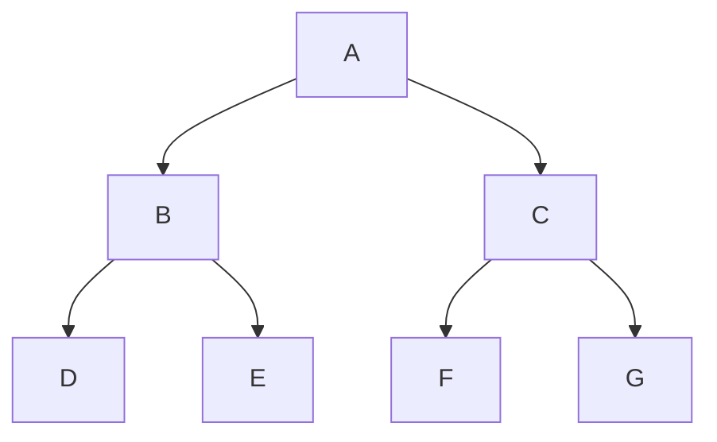
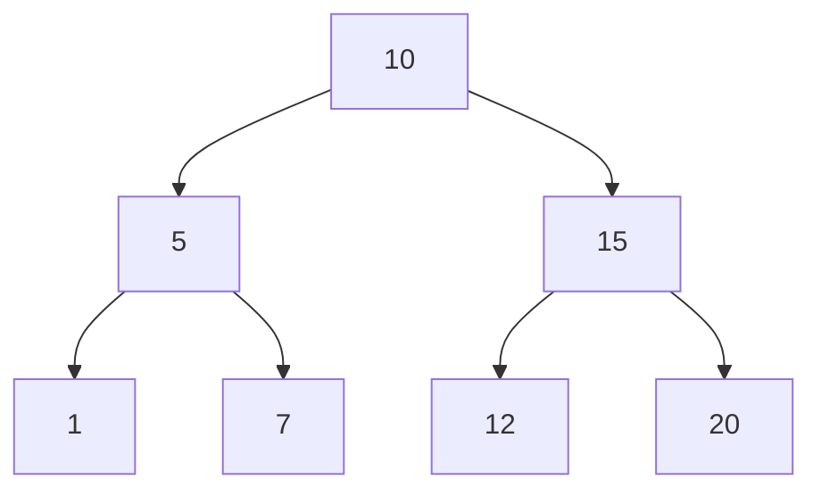
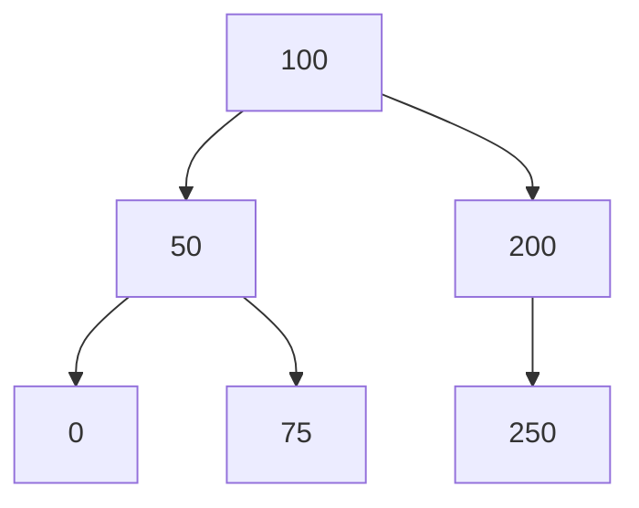

<span style="color:rgb(255, 0, 0)">All Left Subtree elements are smaller.</span>
<span style="color:rgb(255, 0, 0)">All Right Subtree elements are bigger.</span>

Strict | Full Binary Tree: every node has to have 0 or 2 children (not 1)

# Array Representation

Level by level, from left to right.

Element at is at index
<span style="color:rgb(255, 0, 0)">left child index:</span> index * 2 + 1;
<span style="color:rgb(255, 0, 0)">right child index:</span> index * 2 + 2;
<span style="color:rgb(255, 0, 0)">parent index:</span> (index - 1) / 2;



### [A B C D E F G]

```cpp
class ArrayBasedBinarySearchTree {
    static constexpr int EMPTY_VALUE = 0;
    int* data;
    size_t size;
public:
    ArrayBasedBinarySearchTree() : data(nullptr), size(0) {}

    explicit ArrayBasedBinarySearchTree(const size_t& size) : data(new int[size]{}), size(size) {}

    ArrayBasedBinarySearchTree(const int* inputData, const size_t& size) : data(new int[size]), size(size) {
        memcpy(data, inputData, sizeof(int) * size);
    }

    ArrayBasedBinarySearchTree(const ArrayBasedBinarySearchTree& other) : size(other.size), data(new int[other.size]) {
        memcpy(this->data, other.data, sizeof(int) * other.size);
    }

    ArrayBasedBinarySearchTree& operator=(const ArrayBasedBinarySearchTree& other) {
        if (this == &other)
            return *this;

        this->size = other.size;
        delete[] this->data;
        this->data = new int[other.size];
        memcpy(this->data, other.data, sizeof(int) * other.size);
        return *this;
    }

    static void resizeArray(int*& array, size_t& arraySize, const size_t& newArraySize) {
        int* newArray = new int[newArraySize]{};
        memcpy(newArray, array, sizeof(int) * arraySize);

        delete[] array;
        array = newArray;
        arraySize = newArraySize;
    }

    void insertElement(const int& insertElement) {
        if (insertElement == 0) {
            std::cout << "0 is invalid element.\n";
            return;
        }

        int insertIndex{};

        if (this->data != nullptr) {
            while (insertIndex < this->size) {
                if (*(this->data + insertIndex) == EMPTY_VALUE) {
                    *(this->data + insertIndex) = insertElement;
                    return;
                }

                if (*(this->data + insertIndex) > insertElement) // Move to left child
                    insertIndex = insertIndex * 2 + 1;
                else if (*(this->data + insertIndex) < insertElement) // Move to right child
                    insertIndex = insertIndex * 2 + 2;
                else // If the element is found, return
                    return;
            }
        }

        resizeArray(this->data, this->size, insertIndex + 1);
        *(this->data + insertIndex) = insertElement;
    }

    ~ArrayBasedBinarySearchTree() {
        delete[] this->data;
    }

    friend std::ostream& operator<<(std::ostream& os, const ArrayBasedBinarySearchTree& arrayBasedTree);
};

std::ostream& operator<<(std::ostream& os, const ArrayBasedBinarySearchTree& arrayBasedTree) {
    if (arrayBasedTree.size > 0) {
        int nullIndex = 0;

        os << "```mermaid\ngraph TD\n\t" << *arrayBasedTree.data << '\n';

        for (int i = 0; i < arrayBasedTree.size; ++i) {
            const int currentElement = *(arrayBasedTree.data + i);
            const int leftChild = i * 2 + 1 < arrayBasedTree.size ? *(arrayBasedTree.data + i * 2 + 1) : 0;
            const int rightChild = i * 2 + 2 < arrayBasedTree.size ? *(arrayBasedTree.data + i * 2 + 2) : 0;

            if (leftChild != 0 || rightChild != 0) {
                if (leftChild == 0)
                    os << '\t' << currentElement << " --> X" << ++nullIndex << "[\"X\"]\n";
                else
                    os << '\t' << currentElement << " --> " << leftChild << '\n';

                if (rightChild == 0)
                    os << '\t' << currentElement << " --> X" << ++nullIndex << "[\"X\"]\n";
                else
                    os << '\t' << currentElement << " --> " << rightChild << '\n';
            }
        }
        os << "```";

    } else {
        os << "Empty Tree.\n";
    }

    return os;
}

int main() {
    size_t arrSize = 7;
    int* data = new int[arrSize]{10, 5, 15, 1, 7, 12, 20};

    ArrayBasedBinarySearchTree arrayBasedTree{data, arrSize};
    // ArrayBasedBinarySearchTree arrayBasedTree{};

    // arrayBasedTree.insertElement(6);
    arrayBasedTree.insertElement(8);

    std::cout << arrayBasedTree;

    delete[] data;
    return 0;
}
```

___
## <span style="color:rgb(97, 175, 239)">Complete Binary Tree</span>

All Elements are filled from left to right



### [10 5 15 1 7 12 20]

## <span style="color:rgb(97, 175, 239)">Non Complete Binary Tree</span>



### [A B C _ E]
### <span style="color:rgb(255, 0, 0)">200 -> 150 is missing</span>


___
## Search for an Element in BST (Binary Search Tree)

```cpp
Node* binarySearchTree(Node* node, const int& searchNumber) {  
    if (node) {  
        if (node->number == searchNumber)  
            return node;  
  
        if (node->number < searchNumber)  
            return binarySearchTree(node->rightChild, searchNumber);  
  
        return binarySearchTree(node->leftChild, searchNumber);  
    }  
    return nullptr;  
}

Node* binarySearchTree(Node* node, const int& searchElement) {  
    while (node) {  
        if (node->data == searchElement)  
            return node;  
        if (node->data > searchElement)  
            node = node->leftChild;  
        else  
            node = node->rightChild;  
    }  
    
    return nullptr;  
}
```

## Create and Insert in BST (Binary Search Tree)

```cpp
struct Node {
    int number;
    Node* leftChild;
    Node* rightChild;
};

Node* insertInBinarySearchTree(Node* node, const int& insertValue, Node* previous = nullptr, Node* first = nullptr) {
    if (node) {
        if (node->number == insertValue)
            return node;

        if (node->number < insertValue)
            return insertInBinarySearchTree(node->rightChild, insertValue, node, first == nullptr ? node : first);

        return insertInBinarySearchTree(node->leftChild, insertValue, node, first == nullptr ? node : first);
    }

    if (previous) {
        Node* newNode = new Node{insertValue, nullptr, nullptr};

        if (previous->number < insertValue)
            previous->rightChild = newNode;
        else
            previous->leftChild = newNode;

        return first;
    }

    return new Node{insertValue, nullptr, nullptr};
}

Node* createBinarySearchTree(const int* array, const int& arraySize) {
    Node* tree = nullptr;

    for (int i = 0; i < arraySize; ++i)
        tree = insertInBinarySearchTree(tree, *(array + i));

    return tree;
}

int main() {
    constexpr int arraySize = 8;
    const int* array = new int[arraySize]{9, 15, 5, 20, 6, 8, 12, 25};

    Node* tree = createBinarySearchTree(array, arraySize);

    delete[] array;

    return 0;
}
```

## Delete from Binary Search Tree

```cpp
int getHeightOfaBinarySearchTree(const Node *node) {
    if (node) {
        const int x = getHeightOfaBinarySearchTree(node->leftChild);
        const int y = getHeightOfaBinarySearchTree(node->rightChild);

        return std::max(x, y) + 1;
    }

    return 0;
}

Node *findInorderPredecessor(Node *node) {
    while (node && node->rightChild)
        node = node->rightChild;
    return node;
}

Node *findInorderSuccessor(Node *node) {
    while (node && node->leftChild)
        node = node->leftChild;
    return node;
}

Node *deleteFromBinarySearchTree(Node *node, const int &deleteValue) {
    if (node) {
        if (deleteValue < node->number) {
            node->leftChild = deleteFromBinarySearchTree(node->leftChild, deleteValue);

        } else if (deleteValue > node->number) {
            node->rightChild = deleteFromBinarySearchTree(node->rightChild, deleteValue);

        } else {
            if (!node->leftChild && !node->rightChild) { // If it's a leaf
                delete node;
                return nullptr;
            }

            if (getHeightOfaBinarySearchTree(node->leftChild) > getHeightOfaBinarySearchTree(node->rightChild)) { // If left subtree is bigger
                const Node *predecessor = findInorderPredecessor(node->leftChild);
                node->number = predecessor->number;
                node->leftChild = deleteFromBinarySearchTree(node->leftChild, predecessor->number);

            } else { // If right subtree >= left subtree
                const Node *successor = findInorderSuccessor(node->rightChild);
                node->number = successor->number;
                node->rightChild = deleteFromBinarySearchTree(node->rightChild, successor->number);
            }
        }
        return node;
    }
    return nullptr;
}
```

____
## Program for generating Mermaid BST

```cpp
#include <iostream>
#include <queue>
#include <sstream>


struct Node {
    int number;
    Node* leftChild;
    Node* rightChild;
};

#define EMPTY_NODE_VALUE -1

Node* initializeTree() {
    std::queue<Node*> treeQueue;

    int rootNumber;
    std::cout << "Enter Root: ";
    std::cin >> rootNumber;

    Node* root = new Node{rootNumber, nullptr, nullptr};
    treeQueue.push(root);

    while (!treeQueue.empty()) {
        Node* currentNode = treeQueue.front();
        int leftNumber, rightNumber;

        std::cout << "Enter left child of " << currentNode->number << ": ";
        std::cin >> leftNumber;

        if (leftNumber != EMPTY_NODE_VALUE) {
            Node* left = new Node{leftNumber, nullptr, nullptr};
            currentNode->leftChild = left;
            treeQueue.push(left);
        } else
            std::cout << "No left child added.\n";


        std::cout << "Enter right child of " << currentNode->number << ": ";
        std::cin >> rightNumber;

        if (rightNumber != EMPTY_NODE_VALUE) {
            Node* right = new Node{rightNumber, nullptr, nullptr};
            currentNode->rightChild = right;
            treeQueue.push(right);
        } else
            std::cout << "No right child added.\n";

        treeQueue.pop();
    }

    return root;
}

Node* binarySearchTree(Node* node, const int& searchNumber) {
    if (node) {
        if (node->number == searchNumber)
            return node;

        if (node->number < searchNumber)
            return binarySearchTree(node->rightChild, searchNumber);

        return binarySearchTree(node->leftChild, searchNumber);
    }

    return nullptr;
}

Node* insertInBinarySearchTree(Node* node, const int& insertValue, Node* previous = nullptr, Node* first = nullptr) {
    if (node) {
        if (node->number == insertValue)
            return node;

        if (node->number < insertValue)
            return insertInBinarySearchTree(node->rightChild, insertValue, node, first == nullptr ? node : first);

        return insertInBinarySearchTree(node->leftChild, insertValue, node, first == nullptr ? node : first);
    }

    if (previous) {
        Node* newNode = new Node{insertValue, nullptr, nullptr};

        if (previous->number < insertValue)
            previous->rightChild = newNode;
        else
            previous->leftChild = newNode;

        return first;
    }

    return new Node{insertValue, nullptr, nullptr};
}

Node* createBinarySearchTree(const int* array, const int& arraySize) {
    Node* tree = nullptr;

    for (int i = 0; i < arraySize; ++i)
        tree = insertInBinarySearchTree(tree, *(array + i));

    return tree;
}

void displayMermaidBinarySearchTreeNode(const Node* node) {
    static int nullNumber{};

    if (node && (node->leftChild || node->rightChild)) {
        if (node->leftChild)
            std::cout << '\t' << node->number << " --> " << node->leftChild->number << '\n';
        else
            std::cout << '\t' << node->number << " --> X" << ++nullNumber << "[\"X\"]" << '\n';

        if (node->rightChild)
            std::cout << '\t' << node->number << " --> " << node->rightChild->number << '\n';
        else
            std::cout << '\t' << node->number << " --> X" << ++nullNumber << "[\"X\"]" << '\n';

        displayMermaidBinarySearchTreeNode(node->leftChild);
        displayMermaidBinarySearchTreeNode(node->rightChild);
    }
}

void generateMermaidBinarySearchTree(const Node* node) {
    if (!node) {
        std::cout << "Empty Tree.\n";
        return;
    }
    std::cout << "```mermaid\n" << "graph TD\n\t" << node->number << '\n';

    displayMermaidBinarySearchTreeNode(node);

    std::cout << "```";
}

int main() {
    constexpr int arraySize = 8;
    const int* array = new int[arraySize]{9, 15, 5, 20, 6, 8, 12, 25};

    Node* treeNode = createBinarySearchTree(array, arraySize);

    generateMermaidBinarySearchTree(treeNode);

    delete[] array;

    return 0;
}
```
