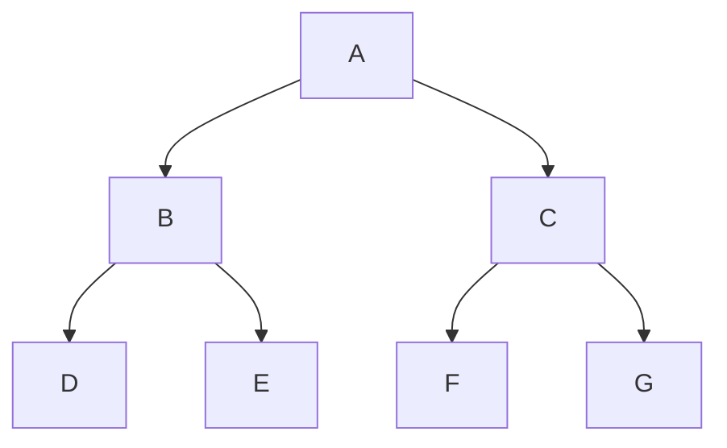
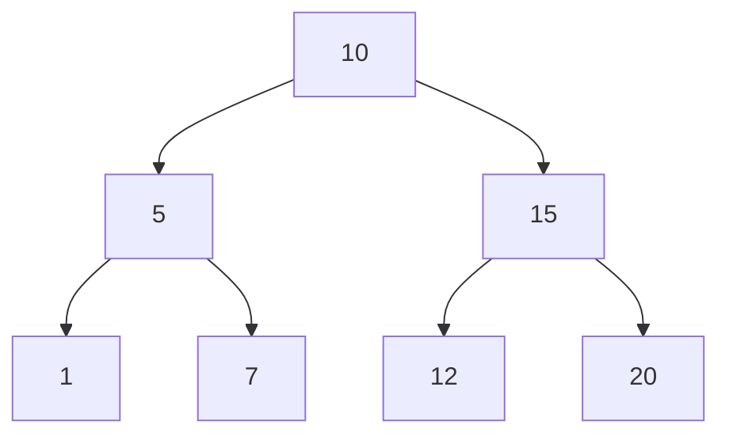
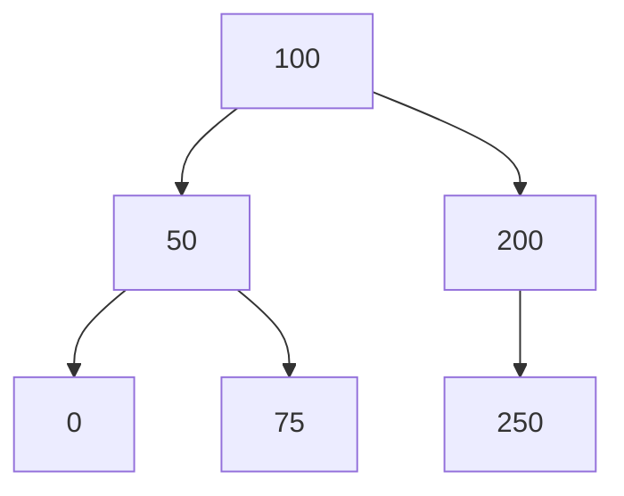

<span style="color:rgb(255, 0, 0)">All Left Subtree elements are smaller.</span>
<span style="color:rgb(255, 0, 0)">All Right Subtree elements are bigger.</span>

Strict | Full Binary Tree: every node has to have 0 or 2 children (not 1)

### Array Representation

Level by level, from left to right.

Element at is at index
<span style="color:rgb(255, 0, 0)">left child index:</span> index * 2 + 1;
<span style="color:rgb(255, 0, 0)">right child index:</span> index * 2 + 2;
<span style="color:rgb(255, 0, 0)">parent index:</span> (index - 1) / 2



### [A B C D E F G]

___
## <span style="color:rgb(97, 175, 239)">Complete Binary Tree</span>

All Elements are filled from left to right



### [10 5 15 1 7 12 20]

## <span style="color:rgb(97, 175, 239)">Non Complete Binary Tree</span>



### [A B C _ E]
### <span style="color:rgb(255, 0, 0)">200 -> 150 is missing</span>


___
## Implementation

```cpp
Node* binarySearchTree(Node* node, const int& searchElement) {    
	if (node == nullptr)    
		return nullptr;    
	    
	if (node->data == searchElement)    
		return node;    
	    
	if (node->data < searchElement)    
		return binarySearchTree(node->rightChild, searchElement);    
	
	// if (node->data > searchElement)    
	return binarySearchTree(node->leftChild, searchElement);  
}

Node* binarySearchTree(Node* node, const int& searchElement) {  
    while (node) {  
        if (node->data == searchElement)  
            return node;  
        if (node->data > searchElement)  
            node = node->leftChild;  
        else  
            node = node->rightChild;  
    }  
    
    return nullptr;  
}
```

## Insert Element in Binary Search Tree

```cpp
Node* addElementToBinaryTree(
	Node* currentNode, const int& insertElement, Node* previousNode=nullptr
) {  
    if (currentNode == nullptr) {  
        if (previousNode == nullptr)  
            return new Node{nullptr, insertElement, nullptr};  
  
        Node* newNode = new Node{nullptr, insertElement, nullptr};  
  
        if (previousNode->data < insertElement)  
            previousNode->rightChild = newNode;  
        else  
            previousNode->leftChild = newNode;  
  
        return newNode;  
    }  
    
    if (currentNode->data == insertElement)  
        return currentNode;  
  
    if (currentNode->data > insertElement)  
        return addElementToBinaryTree(currentNode->leftChild, insertElement, currentNode);  
  
    // if (currentNode->data < insertElement)  
    return addElementToBinaryTree(currentNode->rightChild, insertElement, currentNode);  
}

// Iterative approach
Node* addElementToBinaryTree(Node* currentNode, const int& insertElement) {  
    Node* previous = nullptr;  
  
    while (true) {  
        if (currentNode == nullptr) {  
            if (previous == nullptr)  
                return new Node{nullptr, insertElement, nullptr};  
  
            Node* newNode = new Node{nullptr, insertElement, nullptr};  
  
            if (previous->data > insertElement)  
                previous->leftChild = newNode;  
            else  
                previous->rightChild = newNode;  
  
            return newNode;  
        }  
        
        if (currentNode->data == insertElement)  
            return currentNode;  
  
        previous = currentNode;  
  
        if (currentNode->data > insertElement)  
            currentNode = currentNode->leftChild;  
        else  
            currentNode = currentNode->rightChild;  
    }
}
```

## Create binary Tree

```cpp
class Node {  
public:  
    Node *leftChild;  
    int data;  
    Node *rightChild;  
};  
  
Node* createBinarySearchTree(const int* array, const int& arraySize) {  
    if (array == nullptr || arraySize <= 0)  
        return nullptr;  
  
    Node* root = new Node{nullptr, *array, nullptr};  
  
    for (int i = 1; i < arraySize; ++i) {  
        const int currentValue = *(array + i);  
        Node* currentNode = root;  
        Node* previousNode = nullptr;  
  
        while (true) {  
            if (currentNode == nullptr) {  
                Node* newNode = new Node{nullptr, currentValue, nullptr};  
  
                if (previousNode->data > currentValue)  
                    previousNode->leftChild = newNode;  
                else  
                    previousNode->rightChild = newNode;  
  
                break;  
            }  
            
            if (currentNode->data == currentValue)  
                break;  
  
            if (currentNode->data > currentValue) {  
                previousNode = currentNode;  
                currentNode = currentNode->leftChild;  
  
            } else {  
                previousNode = currentNode;  
                currentNode = currentNode->rightChild;  
            }        
		}    
	}
	  
    return root;  
}  
  
void doubleArraySize(int*& array, int& arraySize) {  
    int* newArray = new int[arraySize * 2]{};  
  
    for (int i = 0; i < arraySize; ++i)  
        *(newArray + i) = *(array + i);  
  
    delete[] array;  
    array = newArray;  
    arraySize *= 2;  
}  
  
int main() {  
    std::string line;  
    std::cout << "Enter Tree Elements: ";  
    std::getline(std::cin, line);  
    std::stringstream lineStream{line};  
  
    int dataSize = 20;  
    int* dataArray = new int[dataSize]{};  
  
    int index{};  
    int currentNumber;  
  
    while (lineStream >> currentNumber) {  
        if (index == dataSize)  
            doubleArraySize(dataArray, dataSize);  
  
        *(dataArray + index) = currentNumber;  
        ++index;  
    }  
	    
    Node* root = createBinarySearchTree(dataArray, index);  
  
    delete[] dataArray;  
    return 0;  
}
```


## Delete element

```cpp
bool deleteElementFromABinarySearchTree(Node*& root, const int& deleteElement) {  
    if (!root)  
        return false;  
  
    Node* previousNode = nullptr;  
    Node* currentNode = root;  
  
    while (currentNode && currentNode->data != deleteElement) {  
        previousNode = currentNode;  
  
        if (deleteElement < currentNode->data)  
            currentNode = currentNode->leftChild;  
        else  
            currentNode = currentNode->rightChild;  
    }  
    
    if (!currentNode)  
        return false;  
  
    auto findInorderPredecessor = [](Node* node) -> Node* {  
        if (!node->leftChild)  
            return node->rightChild; // or nullptr if no children  
  
        Node* parent = node;  
        Node* pred = node->leftChild;  
  
        while (pred->rightChild) {  
            parent = pred;  
            pred = pred->rightChild;  
        }  
        if (parent->rightChild == pred)  
            parent->rightChild = pred->leftChild;  
        else  
            parent->leftChild = pred->leftChild;  
  
        return pred;  
    }; 
     
    if (currentNode == root) {  
        Node* replacement = findInorderPredecessor(currentNode);  
        if (!replacement) {  
            delete root;  
            root = nullptr;  
            return true;  
        }  
        if (replacement != root->leftChild)  
            replacement->leftChild = root->leftChild;  
        if (replacement != root->rightChild)  
            replacement->rightChild = root->rightChild;  
  
        delete root;  
        root = replacement;  
        return true;  
    }  
    
    Node* replacement = findInorderPredecessor(currentNode);  
    
    if (!replacement) {  
        if (previousNode->leftChild == currentNode)  
            previousNode->leftChild = nullptr;  
        else  
            previousNode->rightChild = nullptr;  
  
        delete currentNode;  
        return true;  
    }  
    
    if (replacement != currentNode->leftChild)  
        replacement->leftChild = currentNode->leftChild;  
    
    if (replacement != currentNode->rightChild)  
        replacement->rightChild = currentNode->rightChild;  
  
    if (previousNode->leftChild == currentNode)  
        previousNode->leftChild = replacement;  
    else  
        previousNode->rightChild = replacement;  
  
    delete currentNode;  
    return true;  
}
```

