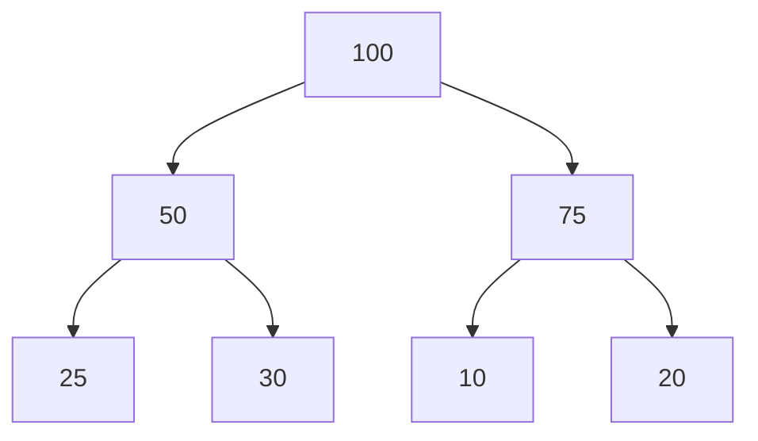
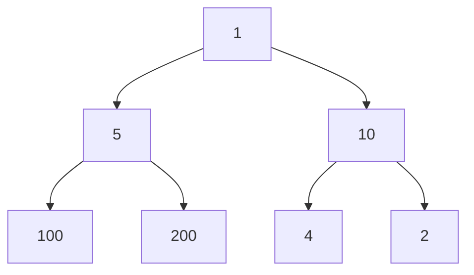

Complete Binary Tree (No gaps between the elements)

## Max Heap

Every element's parent is greater.
Children of every element are smaller.



## Min Heap

Every element's parent is smaller.
Children of every element are greater.



___
# Insertion in Max Heap

Insert at the end, check the parent element, if the parent is smaller -> swap them, until finding a bigger parent or reaching the beginning of the array/heap.

```cpp
// Iterative
void insertInHeap(int*& heap, int& heapSize, const int& insertElement) {
    int* newHeap = new int[heapSize + 1];
    for (int i = 0; i < heapSize; ++i)
        *(newHeap + i) = *(heap + i);

    int insertElementIndex = heapSize;
    *(newHeap + insertElementIndex) = insertElement;

    while (insertElementIndex > 0) {
        // If the element is bigger than it's parent -> swap them
        if (*(newHeap + (insertElementIndex + 1) / 2 - 1) < *(newHeap + insertElementIndex)) {
            *(newHeap + insertElementIndex) ^= *(newHeap + (insertElementIndex + 1) / 2 - 1);
            *(newHeap + (insertElementIndex + 1) / 2 - 1) ^= *(newHeap + insertElementIndex);
            *(newHeap + insertElementIndex) ^= *(newHeap + (insertElementIndex + 1) / 2 - 1);
        }

        insertElementIndex = (insertElementIndex + 1) / 2 - 1;
    }

    delete[] heap;
    heap = newHeap;
    ++heapSize;
}

int main() {
    int heapSize = 7;
    int* heap = new int[heapSize]{30, 25, 21, 20, 19, 18, 15};

    insertInHeap(heap, heapSize, 40);
    insertInHeap(heap, heapSize, 10);

    for (int i = 0; i < heapSize; ++i)
        std::cout << *(heap + i) << ' ';

    delete[] heap;

    return 0;
}

// ------

// Recursive
void heapifyUp(int* maxHeap, const int& currentIndex) {  
    if (currentIndex == 0)  
        return;  
  
    const int parentIndex = (currentIndex - 1) / 2;  
  
    if (*(maxHeap + parentIndex) < *(maxHeap + currentIndex)) {  
        std::swap(*(maxHeap + parentIndex), *(maxHeap + currentIndex));  
        heapifyUp(maxHeap, parentIndex);  
    }
}  
  
void insertInMaxHeap(int*& heap, int& heapSize, const int& insertElement) {  
    int* newMaxHeap = new int[heapSize + 1]{};  
    memcpy(newMaxHeap, heap, sizeof(int) * heapSize);  
  
    *(newMaxHeap + heapSize) = insertElement;  
    heapifyUp(newMaxHeap, heapSize);  
  
    delete[] heap;  
    heap = newMaxHeap;  
    ++heapSize;  
}  
  
int main() {  
    int arrSize = 7;  
    int * array = new int[arrSize]{30, 20, 15, 5, 10, 1, 5};  
  
    insertInMaxHeap(array, arrSize, 40);  
  
    for (int i = 0; i < arrSize; ++i)  
        std::cout << *(array + i) << ' ';  

	return 0;  
}
```

## Insert in Min Heap, Create Min Heap from Array

Check the parent element, if it's bigger swap them until reaching the beginning of the array or encounter a smaller parent.

```cpp
// Recursive
void insertLastElementInMinHeap(int* minHeap, const int& lastElementIndex) {  
    const int parentIndex = (lastElementIndex - 1) / 2;  
  
    if (parentIndex >= 0 && *(minHeap + parentIndex) > *(minHeap + lastElementIndex)) {  
        std::swap(*(minHeap + parentIndex), *(minHeap + lastElementIndex));  
        insertLastElementInMinHeap(minHeap, parentIndex);  
    }
}  
  
void convertArrayToMinHeap(int* minHeap, const int& minHeapSize) {  
    for (int i = 1; i < minHeapSize; ++i)  
        insertLastElementInMinHeap(minHeap, i);  
}
```

## Create Max Heap from an Array, Delete from Max Heap

For converting array to Heap, Call the insert logic for every element after the first one: check if it's parent is smaller, if it is -> swap them etc.
### [[Sorting Algorithms]]

```cpp
void heapifyUp(int* maxHeap, const int& currentIndex) {  
    if (currentIndex == 0)  
        return;  
  
    const int parentIndex = (currentIndex - 1) / 2;  
  
    if (*(maxHeap + parentIndex) < *(maxHeap + currentIndex)) {  
        std::swap(*(maxHeap + parentIndex), *(maxHeap + currentIndex));  
        heapifyUp(maxHeap, parentIndex);  
    }  
}  
  
void convertArrayToMaxHeap(int* array, const int& arraySize) {  
    for (int i = 1; i < arraySize; ++i)  
        heapifyUp(array, i);  
}  
  
int deleteFromMaxHeap(int* maxHeap, int& heapSize) {  
    const int deleteElement = *maxHeap;  
    std::swap(*(maxHeap), *(maxHeap + heapSize - 1));  
  
    int currentIndex = 0;  
  
    while (true) {  
        int leftChildIndex = currentIndex * 2 + 1;  
        int rightChildIndex = currentIndex * 2 + 2;  
  
        if (leftChildIndex >= (heapSize - 1))  
            break;  
  
        const int leftChildValue = *(maxHeap + leftChildIndex);  
        const int rightChildValue = rightChildIndex < (heapSize - 1) ? *(maxHeap + rightChildIndex) : INT_MIN;  
  
        if (*(maxHeap + currentIndex) >= leftChildValue && *(maxHeap + currentIndex) >= rightChildValue)  
            break;  
  
        if (*(maxHeap + currentIndex) < leftChildValue && leftChildValue > rightChildValue) {  
            std::swap(*(maxHeap + currentIndex), *(maxHeap + leftChildIndex));  
            currentIndex = leftChildIndex;  
  
        } else {  
            std::swap(*(maxHeap + currentIndex), *(maxHeap + rightChildIndex));  
            currentIndex = rightChildIndex;  
        }  
    }  
  
    if (heapSize > 0) {  
        --heapSize;  
        return deleteElement;  
    }  
  
    return -1;  
}  
  
void heapSort(int* maxHeap, const int& heapSize) {  
    for (int i = heapSize; i > 0; --i) {  
        int currentSize = i;  
        deleteFromMaxHeap(maxHeap, currentSize);  
    }  
}  
  
int main() {  
    int arrSize = 7;  
    int * array = new int[arrSize]{30, 20, 15, 5, 10, 1, 5};  
    convertArrayToMaxHeap(array, arrSize);  
  
    // std::cout << "Deleted " << deleteFromMaxHeap(array, arrSize) << '\n';  
  
    heapSort(array, arrSize);  
  
    for (int i = 0; i < arrSize; ++i) {  
        std::cout << *(array + i) << ' ';  
    }  
    return 0;  
}
```

## Delete from Min Heap, Min Heap Sort

```cpp
int deleteFromMinHeap(int* minHeap, int& minHeapSize) {  
   const int removedElement = *minHeap;  
    std::swap(*minHeap, *(minHeap + minHeapSize - 1));  
  
    int currentIndex = 0;  
  
    while (true) {  
        int leftChildIndex = currentIndex * 2 + 1;  
        int rightChildIndex = currentIndex * 2 + 2;  
  
        if (leftChildIndex >= (minHeapSize - 1))  
            break;  
  
        int leftElement = *(minHeap + leftChildIndex);  
        int rightElement = rightChildIndex < (minHeapSize - 1) ? *(minHeap + rightChildIndex) : INT_MAX;  
  
        if (*(minHeap + currentIndex) <= leftElement && *(minHeap + currentIndex) <= rightElement)  
            break;  
  
        if (*(minHeap + currentIndex) > leftElement && leftElement < rightElement) {  
            std::swap(*(minHeap + currentIndex), *(minHeap + leftChildIndex));  
            currentIndex = leftChildIndex;  
  
        } else {  
            std::swap(*(minHeap + currentIndex), *(minHeap + rightChildIndex));  
            currentIndex = rightChildIndex;  
        }  
    }  
  
    if (minHeapSize > 0) {  
        --minHeapSize;  
        return removedElement;  
    }  
  
    return -1;  
}  
  
void heapSort(int* minHeap, const int& minHeapSize) {  
    for (int i = minHeapSize; i > 1;)  
        deleteFromMinHeap(minHeap, i);  
}
```

# Delete from Heap

## Only the First Element can be deleted!

Swap the first/biggest element with the end element, look at the children and swap current element with the biggest child, repeat until both children are smaller than current or reaching the end of the array.

```cpp
int deleteFromHeap(int *&heap, int &heapSize) {  
    const int deleteElement = *heap;  
  
    if (heapSize == 1) { // 1 element case  
        delete[] heap;  
  
        --heapSize;  
        heap = nullptr;  
  
        return deleteElement;  
    }  
    
    // Swap the last element with the first one  
    *(heap) ^= *(heap + heapSize - 1);  
    *(heap + heapSize - 1) ^= *(heap);  
    *(heap) ^= *(heap + heapSize - 1);  
  
    if (heapSize > 3) {  
        int index = 0;  
  
        while ((index + 1) * 2 - 1 < heapSize - 1) {  
            const int currentElement = *(heap + index);  
  
            const int leftIndex = (index + 1) * 2 - 1;  
            const int leftChild = heap[leftIndex];  
  
            const int rightIndex = (index + 1) * 2;  
            const int rightChild = (rightIndex < heapSize) ? heap[rightIndex] : INT_MIN;  
            if (leftChild < currentElement && rightChild < currentElement) 
            // Current element is bigger than both of its children  
                break;  
  
            if (leftChild > rightChild) { 
            // If left child > right child && left child > parent -> swap left child with parent  
                *(heap + index) ^= *(heap + (index + 1) * 2 - 1);  
                *(heap + (index + 1) * 2 - 1) ^= *(heap + index);  
                *(heap + index) ^= *(heap + (index + 1) * 2 - 1);  
                index = (index + 1) * 2 - 1;  
  
            } else { 
            // If right child > left child && right child > parent -> swap right child with parent  
                *(heap + index) ^= *(heap + (index + 1) * 2);  
                *(heap + (index + 1) * 2) ^= *(heap + index);  
                *(heap + index) ^= *(heap + (index + 1) * 2);  
                index = (index + 1) * 2;  
            }        }  
    } else if (heapSize == 3 && *(heap) < *(heap + 1)) { 
    // Edge case: 3 elements, left child is bigger than right child  
        *(heap) ^= *(heap + 1);  
        *(heap + 1) ^= *(heap);  
        *(heap) ^= *(heap + 1);  
    }  
    int *newHeap = new int[heapSize - 1]; // Shrink the array by its last element  
    for (int i = 0; i < heapSize - 1; ++i) // Transfer the elements  
        *(newHeap + i) = *(heap + i);  
  
    delete[] heap;  
    heap = newHeap;  
    --heapSize;  
  
    return deleteElement;  
}  
  
int main() {  
    int heapSize = 6;  
    int *heap = new int[heapSize]{40, 35, 30, 15, 10, 25};  
    for (int i = 0; i < 6; ++i)  
        std::cout << deleteFromHeap(heap, heapSize) << ' ';  
  
    delete[] heap;  
    return 0;  
}
```

## Heapify (Faster creation of a Heap)

Basically the same as the insert logic, but instead of starting from the beginning start from the middle -> beginning, comparing elements with it's children. <span style="color:rgb(255, 0, 0)">Instead of n*log(n) it's n.</span>

```cpp
void heapifyDown(int* heap, const int& currentIndex, const int& arraySize) {  
    const int leftChildIndex = currentIndex * 2 + 1;  
    const int rightChildIndex = currentIndex * 2 + 2;  
  
    if (leftChildIndex < arraySize) {  
        const int leftChildElement = *(heap + leftChildIndex);  
        const int rightChildElement = rightChildIndex < arraySize ? *(heap + rightChildIndex) : INT_MIN;  
  
        if (leftChildElement > *(heap + currentIndex) && leftChildElement > rightChildElement) {  
            std::swap(*(heap + currentIndex), *(heap + leftChildIndex));  
            heapifyDown(heap, leftChildIndex, arraySize);  
  
        } else if (rightChildElement > *(heap + currentIndex) && rightChildElement > leftChildElement) {  
            std::swap(*(heap + currentIndex), *(heap + rightChildIndex));  
            heapifyDown(heap, rightChildIndex, arraySize);  
        }  
    }  
}  
  
void heapify(int* array, const int& arraySize) {  
    for (int i = (arraySize / 2) - 1; i >= 0; --i)  
        heapifyDown(array, i, arraySize);  
}  
  
int main() {  
    int arraySize = 5;  
    int* array = new int[arraySize]{20, 10, 1, 54, 23};  
  
    heapify(array, arraySize);  
  
    for (int i = 0; i < arraySize; ++i)  
        std::cout << *(array + i) << ' ';  
  
    delete[] array;  
    return 0;  
}
```