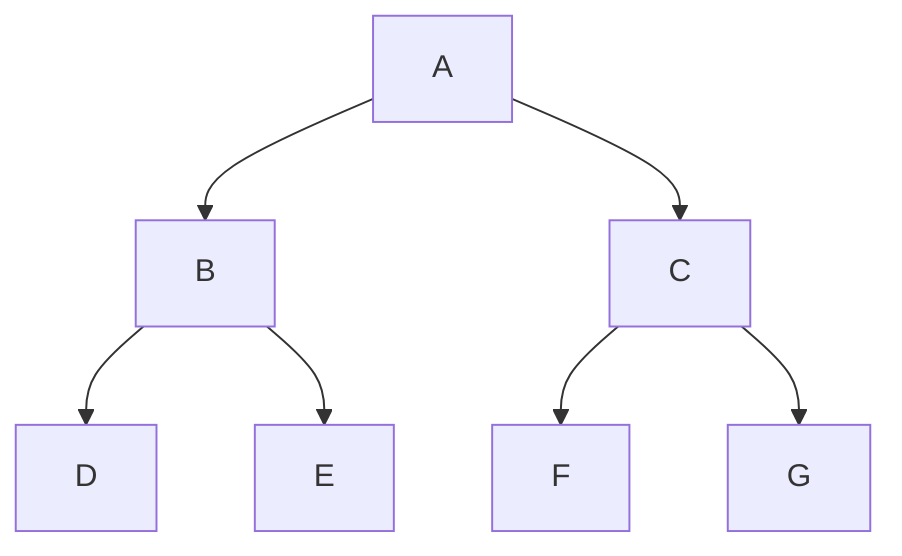

Degree of a node: number of (direct) children it is having.
Level: starts from 1 (root) downwards
Height: same as level, but root is 0

**N-ary Trees**
3-ary Tree; 4-ary Tree; 
**Strict N-ary Tree (has 0 or N number of children)**

___
## Tree Traversals



<span style="color:rgb(255, 0, 0)">Pre order:</span> Root Left Right
A (B D E) (C F G)

<span style="color:rgb(255, 0, 0)">In order:</span> Left Root Right
(D B E) A (F C G)

<span style="color:rgb(255, 0, 0)">Post order:</span> Left Right Root
(D E B) (F G C) A

<span style="color:rgb(255, 0, 0)">Level order:</span>
(A) (B C) (D E F G) 


```cpp
class Node {  
public:  
    Node *leftChild;  
    int data;  
    Node *rightChild;  
};  
  
class Queue {  
    int front;  
    int rear;  
    int size;  
    Node **Q;  
  
public:  
    Queue() : front(-1), rear(-1), size(10), Q(new Node *[size]) {}  
    Queue(int size) : front(-1), rear(-1), size(size), Q(new Node *[size]) {}  
  
    void enqueue(Node *node) {  
        if (rear == size - 1) {  
            std::cout << "Queue is full\n";  
        } else {  
            rear++;  
            Q[rear] = node;  
        }    }  
    Node *dequeue() {  
        if (front == rear) {  
            std::cout << "Queue is empty\n";  
            return nullptr;  
        }        front++;  
        return Q[front];  
    }  
    void Display() const {  
        for (int i = front + 1; i <= rear; ++i)  
            std::cout << Q[i]->data << ' ';  
        std::cout << "\n";  
    }  
    bool isEmpty() {  
        return front == rear;  
    }  
    ~Queue() {  
        delete[] Q;  
    }};  
  
class Tree {  
    Node *root;  
  
public:  
    Tree() : root(nullptr) {}  
    Node *getRoot() const { return this->root; }  
  
    void createTree();  
  
    void preOrder() const { preOrder(this->root); }  
    static void preOrder(Node *p);  
  
    void inOrder() const { inOrder(this->root); }  
    static void inOrder(Node *p);  
  
    void postOrder() const { postOrder(this->root); }  
    static void postOrder(Node *p);  
  
    void levelOrder() const { levelOrder(this->root); }  
    static void levelOrder(Node *p);  
  
    int height() const { return height(this->root); }  
    static int height(Node *p);  
};  
  
void Tree::createTree() {  
    Node *p, *t;  
    int x;  
    Queue q(100);  
  
    std::cout << "Enter root value: ";  
    std::cin >> x;  
  
    root = new Node{nullptr, x, nullptr};  
    q.enqueue(root);  
  
    while (!q.isEmpty()) {  
        p = q.dequeue();  
  
        std::cout << "Enter left child of " << p->data << " (-1 for no child): ";  
        std::cin >> x;  
        if (x != -1) {  
            t = new Node{nullptr, x, nullptr};  
            p->leftChild = t;  
            q.enqueue(t);  
        }  
        std::cout << "Enter right child of " << p->data << " (-1 for no child): ";  
        std::cin >> x;  
        if (x != -1) {  
            t = new Node{nullptr, x, nullptr};  
            p->rightChild = t;  
            q.enqueue(t);  
        }    }}  
  
void Tree::preOrder(Node *p) {  
    if (p) {  
        std::cout << p->data << ' ';  
        preOrder(p->leftChild);  
        preOrder(p->rightChild);  
    }}  
  
void Tree::inOrder(Node *p) {  
    if (p) {  
        inOrder(p->leftChild);  
        std::cout << p->data << ' ';  
        inOrder(p->rightChild);  
    }}  
  
void Tree::postOrder(Node *p) {  
    if (p) {  
        postOrder(p->leftChild);  
        postOrder(p->rightChild);  
        std::cout << p->data << ' ';  
    }}  
  
void Tree::levelOrder(Node *p) {  
    if (!p) return;  
    Queue q(100);  
  
    std::cout << p->data << ' ';  
    q.enqueue(p);  
  
    while (!q.isEmpty()) {  
        p = q.dequeue();  
        if (p->leftChild) {  
            std::cout << p->leftChild->data << ' ';  
            q.enqueue(p->leftChild);  
        }        if (p->rightChild) {  
            std::cout << p->rightChild->data << ' ';  
            q.enqueue(p->rightChild);  
        }    }}  
  
int Tree::height(Node *p) {  
    if (!p) return 0;  
  
    int leftHeight = height(p->leftChild);  
    int rightHeight = height(p->rightChild);  
  
    return std::max(leftHeight, rightHeight) + 1;  
}  
  
int main() {  
    Tree tree;  
  
    tree.createTree();  
  
    std::cout << "\nPreOrder: ";  
    tree.preOrder();  
  
    std::cout << "\nInOrder: ";  
    tree.inOrder();  
  
    std::cout << "\nPostOrder: ";  
    tree.postOrder();  
  
    std::cout << "\nLevelOrder: ";  
    tree.levelOrder();  
  
    std::cout << "\nHeight: " << tree.height() << "\n";  
  
    return 0;  
}
```


## Delete element

```cpp
bool deleteElementFromABinarySearchTree(Node*& root, const int& deleteElement) {  
    if (!root)  
        return false;  
  
    Node* previousNode = nullptr;  
    Node* currentNode = root;  
  
    while (currentNode && currentNode->data != deleteElement) {  
        previousNode = currentNode;  
  
        if (deleteElement < currentNode->data)  
            currentNode = currentNode->leftChild;  
        else  
            currentNode = currentNode->rightChild;  
    }  
    
    if (!currentNode)  
        return false;  
  
    auto findInorderPredecessor = [](Node* node) -> Node* {  
        if (!node->leftChild)  
            return node->rightChild; // or nullptr if no children  
  
        Node* parent = node;  
        Node* pred = node->leftChild;  
  
        while (pred->rightChild) {  
            parent = pred;  
            pred = pred->rightChild;  
        }  
        if (parent->rightChild == pred)  
            parent->rightChild = pred->leftChild;  
        else  
            parent->leftChild = pred->leftChild;  
  
        return pred;  
    }; 
     
    if (currentNode == root) {  
        Node* replacement = findInorderPredecessor(currentNode);  
        if (!replacement) {  
            delete root;  
            root = nullptr;  
            return true;  
        }  
        if (replacement != root->leftChild)  
            replacement->leftChild = root->leftChild;  
        if (replacement != root->rightChild)  
            replacement->rightChild = root->rightChild;  
  
        delete root;  
        root = replacement;  
        return true;  
    }  
    
    Node* replacement = findInorderPredecessor(currentNode);  
    
    if (!replacement) {  
        if (previousNode->leftChild == currentNode)  
            previousNode->leftChild = nullptr;  
        else  
            previousNode->rightChild = nullptr;  
  
        delete currentNode;  
        return true;  
    }  
    
    if (replacement != currentNode->leftChild)  
        replacement->leftChild = currentNode->leftChild;  
    
    if (replacement != currentNode->rightChild)  
        replacement->rightChild = currentNode->rightChild;  
  
    if (previousNode->leftChild == currentNode)  
        previousNode->leftChild = replacement;  
    else  
        previousNode->rightChild = replacement;  
  
    delete currentNode;  
    return true;  
}
```

