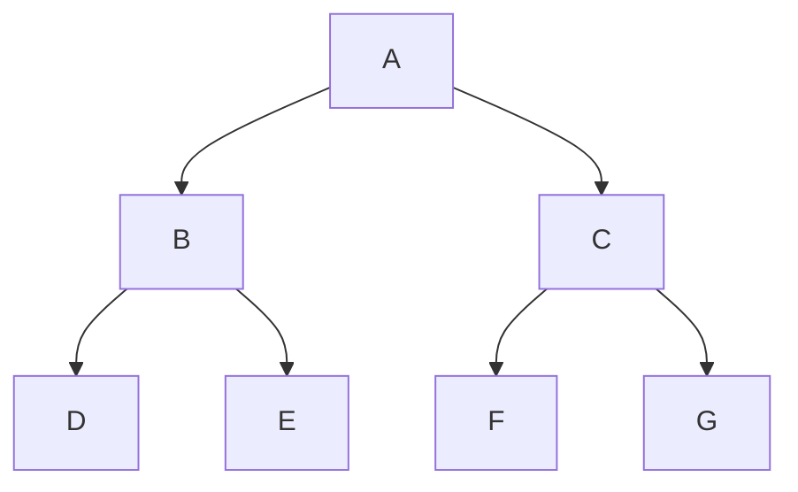
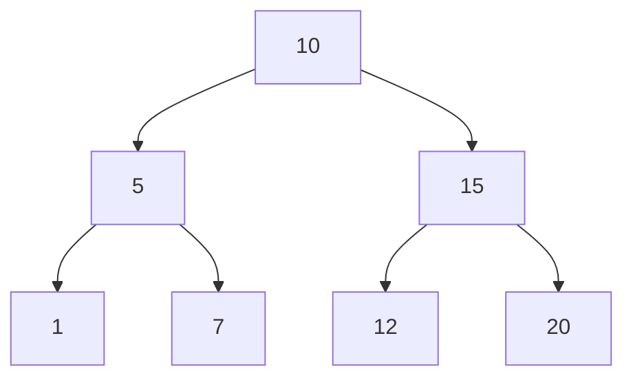

###### Degree of a node: number of (direct) children it is having.
###### Level: starts from 1 (root) downwards
###### Height: same as level, but root is 0

###### **N-ary Trees**
###### 3-ary Tree; 4-ary Tree; 
###### **Strict N-ary Tree (has 0 or N number of children)**

___
## Tree Traversals



<span style="color:rgb(255, 0, 0)">Pre order:</span> Root Left Right 
A (B D E) (C F G) <br>
<span style="color:rgb(255, 0, 0)">In order:</span> Left Root Right
(D B E) A (F C G)<br>
<span style="color:rgb(255, 0, 0)">Post order:</span> Left Right Root
(D E B) (F G C) A<br>
<span style="color:rgb(255, 0, 0)">Level order:</span>
(A) (B C) (D E F G)<br>
___
## Initializing Tree Using Queue

```cpp
struct Node {  
    int number;  
    Node* leftChild;  
    Node* rightChild;  
};  
  
#define EMPTY_NODE_VALUE -1  
  
Node* initializeTree() {  
    std::queue<Node*> treeQueue;  
  
    int rootNumber;  
    std::cout << "Enter Root: ";  
    std::cin >> rootNumber;  
  
    Node* root = new Node{rootNumber, nullptr, nullptr};  
    treeQueue.push(root);  
  
    while (!treeQueue.empty()) {  
        Node* currentNode = treeQueue.front();  
        int leftNumber, rightNumber;  
  
        std::cout << "Enter left child of " << currentNode->number << ": ";  
        std::cin >> leftNumber;  
  
        if (leftNumber != EMPTY_NODE_VALUE) {  
            Node* left = new Node{leftNumber, nullptr, nullptr};  
            currentNode->leftChild = left;  
            treeQueue.push(left);  
        } else  
            std::cout << "No left child added.\n";  
  
        std::cout << "Enter right child of " << currentNode->number << ": ";  
        std::cin >> rightNumber;  
  
        if (rightNumber != EMPTY_NODE_VALUE) {  
            Node* right = new Node{rightNumber, nullptr, nullptr};  
            currentNode->rightChild = right;  
            treeQueue.push(right);  
        } else  
            std::cout << "No right child added.\n";  
  
        treeQueue.pop();  
    }  
    
    return root;  
}
```

## Traversals



```cpp
// 10 5 1 7 15 12 20
void preorderTreeTraversal(const Node* node) {  
    if (node) {  
        std::cout << node->number << ' ';  
        preorderTreeTraversal(node->leftChild);  
        preorderTreeTraversal(node->rightChild);  
        delete node;  
    }
}

// 1 5 7 10 12 15 20
void inorderTreeTraversal(const Node* node) {  
    if (node) {  
        inorderTreeTraversal(node->leftChild);  
        std::cout << node->number << ' ';  
        inorderTreeTraversal(node->rightChild);  
        delete node;  
    }
}

// 1 7 5 12 20 15 10
void postorderTreeTraversal(const Node* node) {  
    if (node) {  
        postorderTreeTraversal(node->leftChild);  
        postorderTreeTraversal(node->rightChild);  
        std::cout << node->number << ' ';  
        delete node;  
    }
}

// 10 5 15 1 7 12 20
void levelTraversal(Node* node) {  
    std::queue<Node*> nodeQueue;  
    nodeQueue.push(node);  
  
    while (!nodeQueue.empty()) {  
        Node* current = nodeQueue.front();  
  
        if (current) {  
            std::cout << current->number << ' ';  
  
            nodeQueue.push(current->leftChild);  
            nodeQueue.push(current->rightChild);  
        }  
        nodeQueue.pop();  
    }
}
```

# [[Binary Search Tree]]

# [[AVL Trees]]