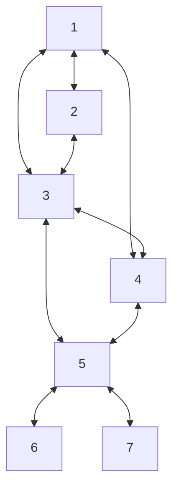
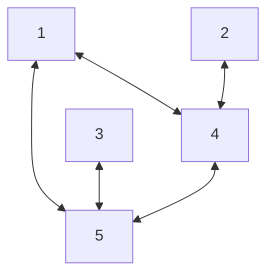

## Matrix Implementation

```cpp
int main() {  
    int lastNode = 7;  
    int** matrix = new int*[lastNode + 1];  
  
    for (int i = 1; i < lastNode + 1; ++i)  
        *(matrix + i) = new int[lastNode + 1]{};  
  
    *(*(matrix + 1) + 2) = 1;  
    *(*(matrix + 1) + 3) = 1;  
    *(*(matrix + 1) + 4) = 1;  
  
    *(*(matrix + 2) + 1) = 1;  
    *(*(matrix + 2) + 3) = 1;  
  
    *(*(matrix + 3) + 1) = 1;  
    *(*(matrix + 3) + 2) = 1;  
    *(*(matrix + 3) + 4) = 1;  
    *(*(matrix + 3) + 5) = 1;  
  
    *(*(matrix + 4) + 1) = 1;  
    *(*(matrix + 4) + 3) = 1;  
    *(*(matrix + 4) + 5) = 1;  
  
    *(*(matrix + 5) + 3) = 1;  
    *(*(matrix + 5) + 4) = 1;  
    *(*(matrix + 5) + 6) = 1;  
    *(*(matrix + 5) + 7) = 1;  
  
    *(*(matrix + 6) + 5) = 1;  
  
    *(*(matrix + 7) + 5) = 1;  
  
    for (int i = 1; i < lastNode + 1; ++i) {  
        std::cout << "Node " << i << ": ";  
        
        for (int j = 1; j < lastNode + 1; ++j)  
            std::cout << *(*(matrix + i) + j) << ' ';  
        
        std::cout << '\n';  
        
        delete[] *(matrix + i);  
    }    
    
    delete[] matrix;  
    
    return 0;  
}
```



## Breadth First Search using a Matrix

```cpp
void BFS(const int& startingNode, const int& lastNode, int** matrix) {  
    int* visitedNodes = new int[lastNode + 1]{}; // Array keeping track which nodes were previously explored  
    std::queue<int> nodeQueue;  
  
    std::cout << startingNode << ' ';  
  
    ++visitedNodes[startingNode];  
    nodeQueue.push(startingNode);  
  
    while (!nodeQueue.empty()) {  
        const int currentNode = nodeQueue.front();  
        nodeQueue.pop();  
  
        for (int matrixCol = 1; matrixCol < lastNode + 1; ++matrixCol) // Iterate through the matrix row  
            // Check with which nodes it has connection and haven't been printed        
            if (*(*(matrix + currentNode) + matrixCol) == 1 && *(visitedNodes + matrixCol) == 0) {  
                std::cout << matrixCol << ' ';  
                *(visitedNodes + matrixCol) = 1;  
                nodeQueue.push(matrixCol);  
            }    
		}  
    delete[] visitedNodes;  
}

// Node 1: 0 1 1 1 0 0 0  
// Node 2: 1 0 1 0 0 0 0  
// Node 3: 1 1 0 1 1 0 0  
// Node 4: 1 0 1 0 1 0 0  
// Node 5: 0 0 1 1 0 1 1  
// Node 6: 0 0 0 0 1 0 0  
// Node 7: 0 0 0 0 1 0 0
```

## Breadth First Search using a Struct

```cpp
struct GraphNode {
    int value;
    int index;
    int connectionsCount;
    GraphNode** connections;
};

void BFS(const int& nodesCount, GraphNode* graphNode) {
    int* visitedNodes = new int[nodesCount + 1]{};

    std::queue<GraphNode*> graphNodesQueue;

    std::cout << graphNode->value << ' ';
    graphNodesQueue.push(graphNode);
    *(visitedNodes + graphNode->index) = graphNode->value;

    while (!graphNodesQueue.empty()) {
        GraphNode* currentGraphNode = graphNodesQueue.front();
        graphNodesQueue.pop();

        for (int i = 0; i < currentGraphNode->connectionsCount; ++i) {
            GraphNode* current = *(currentGraphNode->connections + i);
          
			if (*(visitedNodes + current->index) == 0) {
                std::cout << current->value << ' ';
                *(visitedNodes + current->index) = current->value;
                graphNodesQueue.push(current);
            }
        }
    }

    delete[] visitedNodes;
}

int main() {
    GraphNode* one = new GraphNode{10, 1, 2, nullptr};
    GraphNode* two = new GraphNode{20, 2, 1, nullptr};
    GraphNode* three = new GraphNode{30, 3, 1, nullptr};
    GraphNode* four = new GraphNode{40, 4, 3, nullptr};
    GraphNode* five = new GraphNode{50, 5, 3, nullptr};

    one->connections = new GraphNode*[one->connectionsCount]{four, five};
    two->connections = new GraphNode*[two->connectionsCount]{four};
    three->connections = new GraphNode*[three->connectionsCount]{five};
    four->connections = new GraphNode*[four->connectionsCount]{one, two, five};
    five->connections = new GraphNode*[five->connectionsCount]{one, three, four};

    constexpr int lastNodeIndex = 5;
    int* visitedNodes = new int[lastNodeIndex + 1]{};

    BFS(lastNodeIndex, one);

	return 0;
}
```



## Depth First Search using a Matrix

```cpp
void DFS(const int& startingIndex, int* visitedNodes, int** matrix, const int& lastNode) {
    if (*(visitedNodes + startingIndex) == 0) {
        *(visitedNodes + startingIndex) = 1;

        for (int matrixCol = 1; matrixCol < lastNode + 1; ++matrixCol) {
            if (*(*(matrix + startingIndex) + matrixCol) == 1 && *(visitedNodes + matrixCol) == 0) {
                std::cout << matrixCol << ' ';
                DFS(matrixCol, visitedNodes, matrix, lastNode);
            }
        }
    }
}

void DfsInit(const int& startingIndex, int** matrix, const int& lastNode) {
    std::cout << startingIndex << ' ';

    int* visitedNodes = new int[lastNode + 1]{};

    DFS(startingIndex, visitedNodes, matrix, lastNode);
}
```

## Depth First Search using a Struct

```cpp
struct GraphNode {
    int value;
    int index;
    int connectionsCount;
    GraphNode** connections;
};

void DFS(GraphNode* graphNode, int* visitedNodes) {
    if (*(visitedNodes + graphNode->index) == 0) {
        std::cout << graphNode->value << ' ';

        *(visitedNodes + graphNode->index) = graphNode->value;

        for (int i = 0; i < graphNode->connectionsCount; ++i)
            DFS(*(graphNode->connections + i), visitedNodes);
    }
}

int main() {
    GraphNode* one = new GraphNode{10, 1, 2, nullptr};
    GraphNode* two = new GraphNode{20, 2, 1, nullptr};
    GraphNode* three = new GraphNode{30, 3, 1, nullptr};
    GraphNode* four = new GraphNode{40, 4, 3, nullptr};
    GraphNode* five = new GraphNode{50, 5, 3, nullptr};

    one->connections = new GraphNode*[one->connectionsCount]{four, five};
    two->connections = new GraphNode*[two->connectionsCount]{four};
    three->connections = new GraphNode*[three->connectionsCount]{five};
    four->connections = new GraphNode*[four->connectionsCount]{one, two, five};
    five->connections = new GraphNode*[five->connectionsCount]{one, three, four};

    constexpr int lastNodeIndex = 5;
    int* visitedNodes = new int[lastNodeIndex + 1]{};

    DFS(one, visitedNodes);

    // for (int i = 1; i < lastNodeIndex + 1; ++i)
    //     std::cout << *(visitedNodes + i) << ' ';

    return 0;
}
```

## Prim's algorithm
????

```cpp
#include <iostream>
#include <vector>
#include <sstream>

void primsProgram(int** matrix, const int& biggestNode) {
    int minCost = INT_MAX;
    int minRow{}, minCol{};

    for (int i = 1; i < biggestNode + 1; ++i)
        for (int j = 1; j < biggestNode + 1; ++j)
            if (*(*(matrix + i) + j) < minCost) { // Finding the smallest
                minCost = *(*(matrix + i) + j);
                minRow = i; minCol = j;
            }

    int* nearArray = new int[biggestNode + 1]{};
    for (int i = 0; i < biggestNode + 1; ++i)
        *(nearArray + i) = INT_MAX;

    int** spanningTreeSolution = new int*[2];
    *spanningTreeSolution = new int[biggestNode - 1]{};
    *(spanningTreeSolution + 1) = new int[biggestNode - 1]{};

    *(*(spanningTreeSolution)) = minRow;
    *(*(spanningTreeSolution + 1)) = minCol;
    *(nearArray + minRow) = 0;
    *(nearArray + minCol) = 0;

    for (int i = 1; i < biggestNode + 1; ++i) {
        if (*(nearArray + i) != 0 && *(*(matrix + i) + minRow) < *(*(matrix + i) + minCol))
            *(nearArray + i) = minRow;
        else
            *(nearArray + i) = minCol;
    }

    minCost = INT_MAX;
    int nextVertexInMST{};
    for (int i = 1; i < biggestNode - 1; ++i) {
        for (int j = 1; j < biggestNode + 1; ++j) {
            if (*(nearArray + j) != 0 && *(*(matrix + j) + *(nearArray + j)) < minCost) {
                minCost = *(*(matrix + j) + *(nearArray + j));
                nextVertexInMST = j;
            }
        }
        *(*(spanningTreeSolution) + i) = nextVertexInMST;
        *(*(spanningTreeSolution + 1) + i) = *(nearArray + nextVertexInMST);
        *(nearArray + nextVertexInMST) = 0;

        for (int j = 1; j < biggestNode + 1; ++j) {
            if (*(nearArray + j) != 0 && *(*(matrix + j) + nextVertexInMST) < *(*(matrix + j) + *(nearArray + j)))
                *(nearArray + j) = nextVertexInMST;
        }
    }
}

int main() {
    constexpr int biggestNode = 7;
    int** matrix = new int*[biggestNode + 1];

    for (int i = 0; i < biggestNode + 1; ++i) {
        *(matrix + i) = new int[biggestNode + 1];
        for (int j = 0; j < biggestNode + 1; ++j)
            *(*(matrix + i) + j) = INT_MAX;
    }

    *(*(matrix + 1) + 2) = 25;
    *(*(matrix + 1) + 6) = 5;

    *(*(matrix + 2) + 1) = 25;
    *(*(matrix + 2) + 3) = 12;
    *(*(matrix + 2) + 7) = 10;

    *(*(matrix + 3) + 2) = 12;
    *(*(matrix + 3) + 4) = 8;

    *(*(matrix + 4) + 3) = 8;
    *(*(matrix + 4) + 5) = 16;
    *(*(matrix + 4) + 7) = 14;

    *(*(matrix + 5) + 4) = 16;
    *(*(matrix + 5) + 6) = 20;
    *(*(matrix + 5) + 7) = 18;

    *(*(matrix + 6) + 1) = 5;
    *(*(matrix + 6) + 5) = 20;

    *(*(matrix + 7) + 2) = 10;
    *(*(matrix + 7) + 4) = 14;
    *(*(matrix + 7) + 5) = 18;

    primsProgram(matrix, biggestNode);

    return 0;
}
```